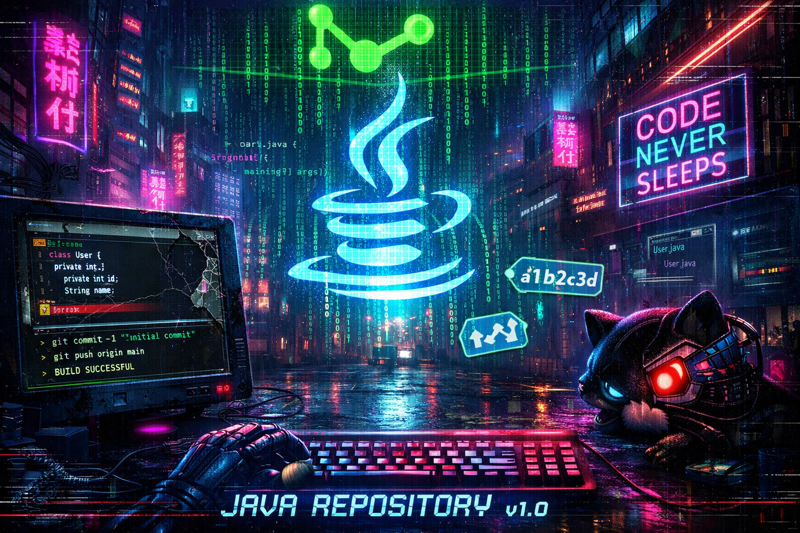

# README
This repository contains all my Java exercises and practice projects for learning and coursework.
## Setup
- To clone this repo
```
git clone https://github.com/b0rnil/java
```

## LICENSE
MIT License (c) 2026 @b0rnil

This project is licensed under the MIT License.
See the [LICENSE](LICENSE) file for more details.